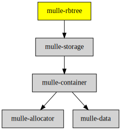

# mulle-rbtree

#### 🍫 mulle-rbtree organizes data in a red/black tree

This is an implementation of a [red-black tree](https://en.wikipedia.org/wiki/Red%E2%80%93black_tree).
[mulle-allocator](//github.com/mulle-c/mulle-allocator) is used to simplify
memory management. It isn't thread-safe.


| Release Version                                       | Release Notes
|-------------------------------------------------------|--------------
|  [](//github.com/mulle-c/mulle-rbtree/actions) | [RELEASENOTES](RELEASENOTES.md) |


## Info

Red-black trees are difficult to explain without lots of diagrams, so little
attempt is made to document this code.  However, an excellent discussion can
be found in the following book, which was used as the reference for writing
this implementation:

```
   Introduction to Algorithms
   Thomas H. Cormen, Charles E. Leiserson, and Ronald L. Rivest
   MIT Press (1990)
   ISBN 0-07-013143-0
```

Some functions use a comparison function pointer, which is expected to have the
following prototype:

``` c
   int (compare *)( void *payload_a, void *payload_b);
```

Interpretation of comparison function return values:

| Return value | Comparison
|--------------|-------------------
|  `< 0`       | `a_a < a_b`
|    `0`       | `a_a == a_b`
|  `> 0`       | `a_a > a_b`


### You are here




## Add

**This project is a component of the [mulle-core](//github.com/mulle-core/mulle-core) library. As such you usually will *not* add or install it
individually, unless you specifically do not want to link against
`mulle-core`.**


### Add as an individual component

Use [mulle-sde](//github.com/mulle-sde) to add mulle-rbtree to your project:

``` sh
mulle-sde add github:mulle-c/mulle-rbtree
```

To only add the sources of mulle-rbtree with dependency
sources use [clib](https://github.com/clibs/clib):


``` sh
clib install --out src/mulle-c mulle-c/mulle-rbtree
```

Add `-isystem src/mulle-c` to your `CFLAGS` and compile all the sources that were downloaded with your project.


## Install

### Install with mulle-sde

Use [mulle-sde](//github.com/mulle-sde) to build and install mulle-rbtree and all dependencies:

``` sh
mulle-sde install --prefix /usr/local \
   https://github.com/mulle-c/mulle-rbtree/archive/latest.tar.gz
```

### Manual Installation

Install the requirements:

| Requirements                                 | Description
|----------------------------------------------|-----------------------
| [mulle-container](https://github.com/mulle-c/mulle-container)             | 🛄 Arrays, hashtables and a queue

Download the latest [tar](https://github.com/mulle-c/mulle-rbtree/archive/refs/tags/latest.tar.gz) or [zip](https://github.com/mulle-c/mulle-rbtree/archive/refs/tags/latest.zip) archive and unpack it.

Install **mulle-rbtree** into `/usr/local` with [cmake](https://cmake.org):

``` sh
cmake -B build \
      -DCMAKE_INSTALL_PREFIX=/usr/local \
      -DCMAKE_PREFIX_PATH=/usr/local \
      -DCMAKE_BUILD_TYPE=Release &&
cmake --build build --config Release &&
cmake --install build --config Release
```


## Author

[Nat!](https://mulle-kybernetik.com/weblog) for Mulle kybernetiK  


