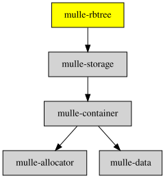

# mulle-rbtree

#### 🍫 mulle-rbtree organizes data in a red/black tree

This is an implementation of a [red-black tree](https://en.wikipedia.org/wiki/Red%E2%80%93black_tree).
[mulle-allocator](//github.com/mulle-c/mulle-allocator) is used to simplify
memory management. It isn't thread-safe.


| Release Version                                       | Release Notes  | AI Documentation
|-------------------------------------------------------|----------------|---------------
|  [](//github.com/mulle-c/mulle-rbtree/actions) | [RELEASENOTES](RELEASENOTES.md) | [DeepWiki for mulle-rbtree](https://deepwiki.com/mulle-c/mulle-rbtree)


## Documentation & Guides

* [API Summary](asset/dox/api/toc)


## Info

Red-black trees are difficult to explain without lots of diagrams, so little
attempt is made to document this code.  However, an excellent discussion can
be found in the following book, which was used as the reference for writing
this implementation:

```
   Introduction to Algorithms
   Thomas H. Cormen, Charles E. Leiserson, and Ronald L. Rivest
   MIT Press (1990)
   ISBN 0-07-013143-0
```

Some functions use a comparison function pointer, which is expected to have the
following prototype:

``` c
   int (*compare)( void *payload_a, void *payload_b);
```

Interpretation of comparison function return values:

| Return value | Comparison
|--------------|-------------------
|  `< 0`       | `a_a < a_b`
|    `0`       | `a_a == a_b`
|  `> 0`       | `a_a > a_b`


### You are here




## Add

mulle-rbtree is a component of the [mulle-core](//github.com/mulle-core/mulle-core) library. So in your code include the mulle-core umbrella header:

``` c
#include <mulle-core/mulle-core.h>
```

### Add mulle-core to a cmake and git project

``` bash
git submodule add https://github.com/mulle-core/mulle-core.git mulle-core
```

Add this to your `CMakeLists.txt`:

``` cmake
add_subdirectory( mulle-core)
target_link_libraries( ${PROJECT_NAME} PRIVATE mulle-core)
```


### Add mulle-core to a mulle-sde project

``` sh
mulle-sde add github:mulle-core/mulle-core
```

### Embed mulle-rbtree with clib

``` sh
clib install --out src mulle-c/mulle-rbtree
```

Append `src` to your include path (e.g. add `-isystem src`  to your `CFLAGS`)
and compile all the sources that were downloaded.


## Author

[Nat!](https://mulle-kybernetik.com/weblog) for Mulle kybernetiK  


